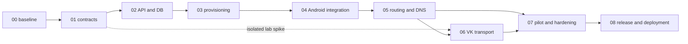

# Hello Kitty VPN: план исполнения для команды агентов

Дата: 2026-10-06 UTC. Это **пакет передачи**, а не отчёт о готовом бэкэнде. Реализация перечисленных этапов ещё не выполнена. Исходники Android очищены в предыдущей задаче; текущий режим — локальный профиль. Авторизация на создание этих документов не означает авторизацию на deployment или публикацию.

## С чего начать

После повторного ревью 2026-10-07 сначала выполни [промпт оставшихся исправлений G01](STAGE_01_REVIEW_FIX_PROMPT.md): он охватывает десять замечаний, PostgreSQL/Kotlin regressions и повторную приёмку контрактов.

После подтверждённой повторной приёмки G01 используй [промпт этапа 02](STAGE_02_AGENT_PROMPT.md): preflight замороженных входов, реализация API/PostgreSQL и приёмка настоящего бэкэнда.

После независимой проверки `STAGE_01_COMPLETION_REPORT.md` используй [промпт исправления этапа 01](STAGE_01_FIX_PROMPT.md): он задаёт исправления контрактов, моделей и доказательств для повторной приёмки G01.

После проверки отчётов S00 используй [следующий промпт агенту](NEXT_AGENT_PROMPT.md): он задаёт исправление приёмки G00, выполнение этапа 01 и передачу этапу 02.

Следующий главный агент получает [готовое задание](AGENT_PROMPT.md), читает [этап 00](00-baseline-and-handoff.md) и существующие документы:

- [Архитектура и технические решения](../implementation-plan.md).
- [Состояние очищенного клиента и выполненные проверки](../app-cleanup.md).
- [Исходный аудит сервера](../baseline-audit.md): исторический снимок, ресурсы и порты повторно проверить.
- [22 пользовательских случая](../research-cases.md): наблюдения с явно недостающими полями, не подтверждённые результаты нашего продукта.

Файлы этого каталога уточняют порядок исполнения, контракты, владельцев и gates. Общий технический план остаётся архитектурным обзором. При противоречии главный агент сначала фиксирует решение в отчёте этапа и синхронизирует оба документа; молча выбирать удобную версию нельзя. Указанные будущие пути — file manifest для реализации, их существование не предполагается.

## Этапы и зависимости

| Этап | Файл | Результат / gate | Зависит от |
|---|---|---|---|
| 00 | [Исходное состояние и передача](00-baseline-and-handoff.md) | G00: защищены существующие изменения, описаны возможности/ограничения среды | Ничего |
| 01 | [Контракты и безопасность](01-contracts-and-security.md) | G01: согласованные OpenAPI/schema/signing vectors/DB invariants | G00 |
| 02 | [Бэкэнд и control plane](02-backend-control-plane.md) | G02: регистрация, токены, ownership и async operations с настоящей тестовой БД | G01 |
| 03 | [Выдача на нодах и reconcile](03-node-provisioning.md) | G03: actual apply/status/expire/revoke, fault recovery, защищённый node API | G02 |
| 04 | [Интеграция Android с API](04-android-integration.md) | G04: физический клиент получает личный профиль и передаёт payload через реальный regular exit | G03 |
| 05 | [Российские маршруты, DNS и IPv6](05-ru-routing-and-networking.md) | G05: подтверждённые RU direct/foreign tunnel, DNS и lifecycle без заявленных утечек | G04 |
| 06 | [VK и белые списки](06-vk-whitelist-transport.md) | G06: экспериментальный транспорт в конкретных реальных allowlist ячейках либо честный отрицательный результат | G05; lab spike возможен после G01 |
| 07 | [Полевой пилот и надёжность](07-pilot-and-hardening.md) | G07: матрица подтверждений, capacity, security, restore/rollback без критических failures | G05; G06 для VK claims |
| 08 | [Релиз и развёртывание](08-release-and-deployment.md) | G08: воспроизводимые свои артефакты, reviewable deploy, разрешённый rollout и post-deploy checks | G07 |

Пунктир допускает исследовательский стенд без изменения production и без обхода зависимостей полноценной приёмки. Ошибка VK не блокирует работу над regular VPN. Однако G07/G08 для продукта с заявленным VK bypass нельзя закрывать, пока G06 не пройден. Возможен regular-only release с явно отключённым экспериментальным модулем и отдельным зафиксированным решением о составе релиза; это не выполнение требования VK и не повод отметить G06 VERIFIED.

Соответствие прежним крупным этапам общего плана: старый 0 → новый 00; старый 1 → 01–02; старый 2 → 03–04; старый 3 → 05; старый 4 → 06; старый 5 → 07; старый 6 → 08.

## Главный агент и субагенты

Главный агент отвечает за контракт между этапами, назначение владельцев, интеграцию, запуск общих проверок, согласование внешних действий и отчёт. Субагент получает конкретный task ID из этапа, разрешённые пути и expected output. Формулировка «сделай backend» без границ недостаточна.

| Роль | Ответственность | Типичные этапы |
|---|---|---|
| `contract-security` | Wire/schema, crypto vectors, threat model, independent review | 01, review 02–06 |
| `storage` | SQL migrations, constraints/indexes, repository transactions, DB tests | 01–03 |
| `api-identity` | HTTP, enrollment/refresh/proof, authorization, idempotency | 02 |
| `provisioning` | Outbox/worker/reconciler, observed state, fault tests | 03 |
| `node-runtime` | Xray gRPC adapter, WDTT contract, node expiry and private API | 03, 06 |
| `android-control` | API client/repository/profile adapter, local fallback, UI integration | 04 |
| `android-network` | Единственный VpnService, routing/DNS/IPv6/protect/bind/lifecycle | 05, 06 |
| `rules-data` | Источники RU правил, нормализация, build/sign/anti-rollback | 05 |
| `vk-transport` | Signaling/TURN/SFU, native IPC, account isolation, transport capability | 06 |
| `verification` | Негативные/fault/regression tests, доказательства и воспроизведение | Все этапы |
| `operations-release` | Изолированная конфигурация, backup/restore, build/sign/source/rollout | 07–08 |

Это роли, а не требование запустить 11 процессов одновременно. Для среды с четырьмя слотами максимум **главный агент + три активных субагента**. Один агент может последовательно выполнять несколько ролей. После завершения задачи слот используется заново. При меньшем доступном лимите задачи идут очередью; зависимости не обходятся ради параллельности.

## Правила совместной работы

1. До запуска волны главный агент фиксирует task IDs, dependencies, owners и write paths в отчёте этапа. Субагент читает актуальные инструкции и соседний код; существующие пользовательские изменения остаются базой.
2. Один файл имеет одного writer. `go.mod/go.sum`, migrations, общий HTTP router, `AppContainer`, `AppRepository`, `AppViewModel`, VpnService, Gradle/locks/verification metadata и Compose/ingress редактируются назначенным владельцем. Остальные предлагают изменения через отчёт/сообщение, не пишут одновременно.
3. Contracts/schema/vectors сначала согласуются в G01. После freeze любое несовместимое изменение требует версии, списка consumers и regression tests. Новый capability не рекламируется до проверки соответствующего runtime.
4. Независимые directories можно разрабатывать параллельно. Исполнение remote mutations, DB migrations на общем экземпляре, Gradle, установка APK и действия ADB с одним устройством сериализуются. Play app APK и Direct test APK смешивать нельзя.
5. Главный агент проверяет diff и фактические результаты. Тесты субагента — evidence, а не замена интеграционного прохода. Чужое утверждение VERIFIED без команды/отчёта/окружения не принимается.
6. Не создавать commits/ветки/PR/releases и не публиковать без действующей авторизации. Не использовать reset/clean, удаление volumes или глобальный firewall flush для восстановления среды. При dirty tree source bundle нельзя автоматически получить «чистым checkout».
7. Заблокированная задача не останавливает независимую работу: например, пока нет SIM/VK account, выполнять contracts, parser tests, native build, privacy/restart tests. Результат реального соединения остаётся NOT RUN или UNABLE TO RUN.

## Постоянные инварианты продукта

Бесплатный Android продукт, сохранённый основной дизайн, без Levik user-facing surfaces/API/support/billing. Один VpnService/TUN. Russian direct выполняется на физической сети устройства, default unknown/shared CDN — tunnel. Foreign traffic не уходит direct при обещанном kill switch. Ключи per-device, нет общего UUID/password в APK. Истечение/отзыв не отменяются offline fallback. Node API management-only. Не собирать историю сайтов, VK passwords/cookies или произвольные config secrets в diagnostics.

Некоммерческий характер не заменяет условия исходных лицензий. Согласованные legacy identifiers остаются на boundary до проверенной migration. RU bypass не гарантирует невозможность блокировки VPN-IP; отсутствие связи или недоступный VK bootstrap не устраняются произвольным SNI.

## Что уже известно и что требует проверки

На 2026-10-06 клиент собран, Play141/Direct169 unit tests и по14 instrumentation tests на Android13 выполнены, lint без errors, есть warnings. Native relay три ABI собран отдельно. Это **историческое evidence очистки**, не новый запуск этих проверок и не доказательство G03–G08.

В checkout нет готового Hello Kitty API/DB/Xray provisioner. Агент relay управляет WDTT; его replay cache сейчас in-memory, durable replay нужно реализовать. mTLS находится на reverse proxy перед loopback агентом. Текущий decryptor не заменяет подписанный device-bound v2 envelope. Существующие direct socket binding/IPv4-only/IPv6 block/MTU defaults требуют доработки и проверки, а не маркетинговой гарантии.

Потребуются: domain ownership, свои signing/update keys, реальная страна/ASN и бюджет foreign exit, допустимые runtime permissions, свои VK accounts и добровольцы с устройствами/SIM. Числа портов и ресурсов из старого аудита — кандидаты, не разрешение занять их. Запрос недостающих вводных должен называть конкретный зависимый gate; самостоятельные code/contract задачи продолжаются.

## Артефакты и завершение

Главный агент хранит текущее состояние в `docs/hellokitty/execution/status.md`, а отчёты — `docs/hellokitty/execution/SNN-report.md`. Эти пути **будущие**: создать при начале исполнения. Каждый task и gate содержит VERIFIED / FAILED / NOT RUN / UNABLE TO RUN, команду, окружение, доказательство и ограничения. [Шаблон отчёта](REPORT_TEMPLATE.md) определяет формат передачи.

Завершение проекта означает готовый проверенный сервис и приложение в согласованном составе, а не наличие девяти MD. До production сначала подготовить конкретный diff/configuration/runbook/rollback и результаты staging; затем выполнить внешний шаг в пределах действующей авторизации. Если нужна новая авторизация, это последняя стадия подготовки, со ссылкой на применимое требование.

Проверка пакета передачи 2026-10-06: VERIFIED — девять этапов/66 task definitions, уникальность IDs, локальные ссылки, Markdown tables/fences/whitespace, `git diff --check`, отсутствие изменения541 non-documentation source/config paths. Cross-review устранил circular prerequisite05↔06, требование готовых SQL migrations до02 и HTTP API доG01, а также несогласованные refresh retry/report paths. Эти проверки подтверждают качество документации; реализация00–08 и её новые runtime tests остаются NOT RUN.
