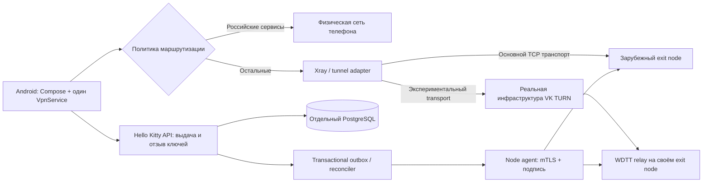

# Hello Kitty VPN: технический план реализации

Дата: 2026-10-06 UTC. **Статус: проектирование. Бэкэнд и новые VPN-узлы ещё не развёрнуты.** Очистка Android-клиента завершена и проверена отдельно в [отчёте](app-cleanup.md). Исходная база и сервер — [аудит](baseline-audit.md), наблюдения пользователей — [исследование](research-cases.md).

Для исполнения другим агентом подготовлен [пакет из девяти этапов](agent-plan/README.md) с задачами субагентам, file ownership, проверками и входными/выходными gates. Этот документ — архитектурный обзор; новые подробности refresh recovery/envelope/node integration фиксируются и проверяются в этапе01 перед contract freeze. Найденные текущие gaps не считаются уже исправленными.

## 1. Результат и границы

Бесплатное Android-приложение Hello Kitty VPN с прежними основными экранами и стилем: подключение, серверы, статистика, настройки. Без платежей, тарифов, пробных периодов, Levik-кабинета, поддержки Levik и запросов на их API. После реализации бэкэнда приложение самостоятельно получает личные ключи устройства и выбирает проверенный маршрут. Пока серверная выдача отсутствует, очищенный клиент принимает локальную конфигурацию; список серверов не заполняется вымышленными узлами.

Целевое поведение: известные российские сервисы используют физическую сеть телефона; остальные — зарубежный VPN-выход. При недоступности основного транспорта есть проверенный резерв, включая экспериментальный VK relay. Для полного отключения связи никакой программный транспорт не обещается. Если доступен только VK, но недоступны авторизация/сигнализация/relay VK, этот режим тоже может не работать.

Раздельная маршрутизация позволяет российским сервисам видеть обычный IP пользователя и снижает обращения VPN-выхода к этим сервисам. Она **не предотвращает обнаружение VPN-IP** провайдером или активным сканированием. Смена IP, разнообразие узлов и транспорты уменьшают последствия блокировки, но не дают гарантии.

Поддержка: Android 8–16 в пределах реальной матрицы устройств, Direct APK прежде всего. Play-вариант сохраняется отдельным, без Direct relay; он не считается функционально идентичным при allowlist. iOS/desktop/router/tethering — отдельные будущие продукты, не часть текущего обязательства. VPN телефона автоматически не распространяется на hotspot-клиентов.

Перед реализацией инфраструктуры требуются домен проекта, проверенная страна/ASN выхода и бюджет/лимиты трафика. Они не препятствуют текущей очистке и проектированию. Используются только свои учётные записи и узлы; пароль VK не отправляется в наш API.

## 2. Архитектура

Control plane не участвует в каждом пользовательском пакете. Его недоступность не рвёт уже разрешённую сессию; offline-профиль ограничен сроком ключей. Data plane не требует кабинета, HTTP API или оплаты на пути к сайтам. Не запускаем Remnawave/x-ui как публичную пользовательскую панель: минимальный собственный API и уже имеющийся node-agent проще связать с бесплатными per-device credentials. Отказ одной ноды не должен ломать выдачу всех остальных.

Предлагаемый стек: Go HTTP API, PostgreSQL отдельной поддерживаемой версии (кандидат 17.11 на дату исследования, точный patch/image digest перепроверяется при реализации), pgx как обоснованная драйверная зависимость, миграции SQL; Xray той же проверенной версии, что клиент, с явным compatibility matrix. Поддержка PostgreSQL проверена по [официальной политике версий](https://www.postgresql.org/support/versioning/). Redis для первого этапа не нужен: challenge/replay/idempotency/outbox в PostgreSQL. Python-скрипт или Compose не заменяют приложение с транзакционными контрактами.

Разделение процессов: `hkvpn-api`, `hkvpn-reconciler`, `hkvpn-db`, node-agent и Xray/WDTT на отдельной ноде. Метрики и администрирование только в management network. Никаких shared credentials с чужими проектами на этом сервере.

## 3. Маршрутизация на телефоне

### 3.1 Порядок решений

Приоритет: обязательные запреты/защита служебных адресов → пользовательское «через VPN» → пользовательское «напрямую» → подтверждённые домены российских сервисов → подтверждённые российские IP для соединений без домена → default VPN. При конфликте пользовательских списков сохранение отклоняется с указанием домена. Каждый маршрут получает reason-code в локальной диагностике; URL и история посещений на сервер не отправляются.

«На серверах VPN исключить .ru» недостаточно: пакет уже вышел с зарубежного IP. Решение принимается локально до выхода с устройства. Direct outbound защищает сокет через `VpnService.protect`, привязывает к выбранному physical Network; возвращение собственного outbound в TUN запрещено. LAN/link-local/multicast проходят по отдельной явной локальной политике и не превращаются в proxy к внутренней сети сервера.

Российский сервис может использовать .com, .org, зарубежный CDN и IPv6; иностранный сайт может использовать .ru или российский CDN. Поэтому «все .ru и все RU ASN» — только эвристика с возможными ошибками. Абсолютно все российские сервисы определить заранее нельзя. Поддерживаем курируемый список важных сервисов и ручное исправление, фиксируем конкретное покрытие.

Стартовый каталог: Госуслуги/ЕСИА, банки из согласованного списка, СБП/эквайринг и их auth endpoints, Яндекс, VK, Ozon, Wildberries, Avito, RuTube, российские операторы, обновления/платёжные endpoints соответствующих приложений. Домены и поддомены проверяются по фактическому сетевому графу сервисов. Не добавляем общий wildcard Cloudflare/Akamai/AWS или весь ASN ради одного банка.

### 3.2 Правила и их обновления

Пакет `routing-rules/v1`: manifest с version, generatedAt, expiresAt, minimumClientVersion, SHA256 файлов и ECDSA P-256/SHA256 detached signature (существующий проверенный verifier, строгий DER формат). Нормализация IDNA, label boundaries (`example.ru` не совпадает с `evil-example.ru`), запрет URL/path/port в доменных полях. CIDR валидируются, дубликаты и private/reserved ranges проверяются отдельно. Публичный root key закреплён в приложении; rotation через подписанный переход старым ключом и запасной ключ. Anti-rollback — последний принятый version в защищённом store.

Обновления раз в сутки с jitter, ETag и ограничением размера; проверка подписи до применения, atomic file replacement, last-known-good и встроенный snapshot. Старый snapshot не обрывает работающий VPN: сообщает возраст и использует консервативное правило default VPN. В аварийном пакете можно быстро убрать ошибочный direct-домен. Источники/лицензии/дата проверки хранятся рядом с каждым набором. Список reachable allowlist IP не используется как список российских сервисов.

Большие списки храним в routing engine внутри TUN, а не превращаем каждый CIDR в системный `VpnService.Builder.addRoute`. В [Amnezia #2976](https://github.com/amnezia-vpn/amnezia-client/issues/2976) Samsung S23+ Android 16/One UI 8.5 создавал 2355 TUN routes и провоцировал crash loop Watch6 Manager; это наблюдение автора, не наш воспроизведённый тест. Для Hello Kitty — небольшой фиксированный набор системных маршрутов, агрегация без расширения direct coverage, лимиты размера/числа правил, измерение RSS/startup time и parcel `LinkProperties` при 1k/10k/30k CIDR. Использование default TUN route позволяет выполнять domain-direct локально без тысячи маршрутов в ConnectivityManager; CIDR trie и конкретная структура подбираются после benchmark, не ради нового собственного routing core.

### 3.3 DNS, IPv6, ECH и QUIC

Есть три разные задачи DNS: bootstrap endpoint VPN, VK signaling/TURN, DNS пользовательских сайтов. Для bootstrap/VK используем resolver physical Android Network и проверенный fallback по таймауту ответа. В whitelist нельзя рассчитывать только на 1.1.1.1/8.8.8.8/DoH: разрешённый IP resolver может отсутствовать.

Пользовательский DNS распределяем по той же политике: российские имена — resolver физической сети, остальные — через туннель. Direct DNS необходим для корректного российского CDN и раскрывает соответствующие имена оператору; это объясняется в настройках. DNS для tunneled domain не уходит напрямую при сбое. Validate answers, TTL, CNAME chain, отрицательные ответы и cache binding к underlying network. Private DNS Android off/auto/strict проверяется отдельно; не отключаем системную настройку автоматически.

Если приложения используют свой DoH/ECH, домен может быть не виден маршрутизатору. При неизвестном домене и shared CDN default VPN; банковское приложение при необходимости исключается целиком по пакету и получает физическую сеть. Sniffing TLS/HTTP/QUIC — дополнительная возможность, не гарантия видимости ECH. Перехват TLS или установка пользовательского CA не нужны. Порядок domain/IP routing сверяется с [Xray routing](https://xtls.github.io/en/config/routing.html).

Сейчас IPv6 заблокирован. План: полноценный IPv4+IPv6 TUN, маршруты `0.0.0.0/0` и `::/0`, direct IPv6 по той же политике, туннельный DNS без обхода; тесты IPv6-only мобильной сети, NAT64/DNS64 и AAAA-only ресурсов. До готовности dual stack не выпускаем заявление «работает на любом операторе». MTU стартует с безопасного значения 1280 для IPv6; 1360/1400/1500 оцениваются экспериментально для каждого транспорта. Не задаём универсальное 1500 для вложенного relay; PMTU/MSS и DF packet tests обязательны.

### 3.4 Kill switch

Режим по умолчанию: при падении tunnel защищённый трафик не выпускается direct; российские маршруты продолжают идти по разрешённому direct outbound в живом VpnService. Если процесс/служба погибают, только системный always-on + block-without-VPN обеспечивает строгую блокировку вне службы. Приложение не может честно гарантировать системный kill switch своим переключателем.

Android lockdown блокирует исключённые из VPN приложения. Для режима «банки по app exclusion» показываем конкретную несовместимость и предлагаем либо domain-direct внутри TUN, либо изменить системный lockdown вручную. Пауза при lockdown может означать отсутствие интернета — это должно быть видно до паузы. Раздельные personal/work profiles не считаются одним VPN. Основание: [Android VPN lifecycle и routing](https://developer.android.com/develop/connectivity/vpn).

## 4. Основные транспорты и состояние подключения

Первый transport: VLESS + Reality TCP на своём зарубежном узле, per-device UUID; выбранный destination/SNI должен быть настоящим доступным TLS-сервисом и пройти проверку корректности настроек. Reality не даёт гарантии против allowlist IP и throttling. Второй кандидат: поддерживаемый текущим core XHTTP/TLS на собственном домене, с проверенной server/client конфигурацией; отдельный hostname/endpoint и независимая проверка HTTP headers/streaming limits. CDN включается только после измерений и проверки условий, не как автоматическое обещание domain fronting.

Обычный WireGuard/AWG или Hysteria2 может быть полезен при свободном UDP, но новый engine не добавляется в MVP без измеренной пользы и Android runtime интеграции. APK не должен рекламировать протоколы, которые импортёр или движок реально не поддерживает. Capability list формируется из выполненных compatibility tests.

Состояния: DISCONNECTED → PREPARING → CONNECTING → VERIFYING → CONNECTED; DEGRADED/RECONNECTING; PAUSED; BLOCKED_BY_NETWORK; CREDENTIAL_EXPIRED; ERROR. Native handshake и наличие TUN недостаточны для CONNECTED: нужен полезный HTTPS response через tunnel с expected status/body и отдельная UDP/DNS проверка. Captive portal/login HTML не считается успехом. Недоступность одного публичного сайта не означает падение всего VPN; минимум свой endpoint + независимый контроль.

Каждая попытка привязана к generation ID и underlying Network. Старые callbacks/health results не переключают новую сессию. Network change отменяет предыдущие попытки и сбрасывает подходящий DNS cache. Transport connect budget 10–15 секунд как стартовый параметр пилота; общий перебор максимум 45 секунд с объяснением, дальше ручное действие. Backoff 1/2/4/8/15 секунд + jitter, cooldown неудачного endpoint 60 секунд; бесконечных параллельных попыток нет. Смена IP не выполняется на каждый единичный timeout.

Auto-server выбирает среди реально доступных узлов по recent payload success, RTT, потере и capacity, с hysteresis. Пинги ограничены, например четырьмя параллельными попытками, отменяются при запуске VPN; TCP ping не выдаётся за bandwidth. Existing connections при переключении могут оборваться: VoIP/игры и долгие HTTP downloads тестируются и это ограничение сообщается корректно.

Doze/OEM: foreground notification, minimal bounded wake lock, network callbacks; не требуем отключения всех оптимизаций без причины. Для Xiaomi/Samsung/OPPO отдельный screen-off тест 60 минут с push и VoIP. Permission revoked/onRevoke, low-memory kill, force-stop, boot, airplane mode, work profile и always-on — обязательные сценарии.

Добавить Infinix/Pixel и сравнение full-tunnel/per-app mode: [Infinix Note30, Android14, #3255](https://github.com/amnezia-vpn/amnezia-client/issues/3255) содержит TUN TX при нулевом исходящем UDP после Doze, с работающим контрольным UDP socket и Windows peer; [Pixel10 Pro XL, Android16, Билайн, #2155](https://github.com/amnezia-vpn/amnezia-client/issues/2155) — отказ только LTE через 1–5 минут. Причины чужих AWG ошибок не переносятся на Xray без воспроизведения. Health loop после wake должен обнаружить отсутствие payload и корректно восстановить adapter; освобождение от battery optimisation само по себе не подтверждает живой data plane.

## 5. VK и белые списки

### 5.1 Проверенные проекты и выбор

| Проект | Зафиксированный commit / лицензия | Роль |
|---|---|---|
| [WDTT Plus](https://github.com/Ivan4537/WDTT-Plus) | В базе v15 `3038b8ddc0306feb21d3c3624e2bc1c3c14639ad`, GPL-3.0; upstream отдельно развивается | Первый pilot: уже согласован с Android adapter/node-agent |
| [vk-turn-proxy](https://github.com/cacggghp/vk-turn-proxy) | `e8a96967dc66f3dbd631596ea6a8b9fe03f9be69`, GPL-3.0 | Сравнительный стенд реального VK TURN, DTLS/TCP/UDP; не смешивать его wire framing с WDTT |
| [whitelist-bypass](https://github.com/kulikov0/whitelist-bypass) | `7c19a7ec40900940fe0c43ea1db7768ee632393d`, MIT | Резервный PoC через VK SFU DataChannel/VP8, если TURN peer-egress ограничен |

Названия и лицензии upstream сохраняются в NOTICES/исходниках; некоммерческий характер не отменяет условия open-source лицензий. Релиз включает corresponding source native library по зафиксированным ревизиям. Вопросы прав на бренд пользователь разрешил в контексте задачи; переиспользование чужих технических ключей/аккаунтов всё равно не требуется.

### 5.2 Первый путь: существующий WDTT

Последовательность испытания: physical Network → DNS VK → user-authorized VK signaling → краткоживущие TURN credentials → TURN allocation → разрешённый peer канал до собственной ноды → аутентифицированный внутренний tunnel → полезный IP traffic. Проходимость каждого шага измеряется отдельно. SNI чужого домена при подключении к запрещённому IP не заменяет доступный TURN/SFU.

Приложение использует **существующий VpnService**: relay adapter предоставляет локальный канал для Xray, а не запускает второй VpnService из внешнего APK. Все внешние relay sockets проходят protect/bind. Adapter поддерживает cancellation, generation checks, timeout, сокетный cleanup, поведение при смерти subprocess и ограниченные очереди. Сохранённые wire names из базы переименовываются только в согласованной protocol v2 миграции, после golden-vector tests обеих сторон.

Авторизация VK добровольная, отдельная от Hello Kitty device identity. Cookies/tokens остаются на устройстве в изолированном защищённом хранилище, не попадают в crash report и API. Использовать системный/browser/WebView поток, соответствующий реально доступному методу проекта; не запрашивать пароль через собственную форму и не обходить MFA. Если необходим выделенный creator account на сервере — отдельный секрет с минимальным доступом, не пользовательский аккаунт, с документированным отзывом. Captcha, истечение cookies и ограничения аккаунта показываются как отдельные состояния, без бесконечных запросов и массовой регистрации аккаунтов.

Нельзя рассчитывать на no-DTLS как надёжный режим: его доступность/ограничения отличаются. Credentials обновляются до истечения, при смене сети повторно создаётся allocation; определяются UDP→TCP fallback и максимальная lifetime. TURN server list из signaling валидируется как недоверенный ввод, destination node берётся из подписанного bootstrap, не из произвольной ссылки. DTLS/TURN сами по себе не заменяют проверку личности своего exit node; внутреннее шифрование и проверка server key обязательны.

Сервер: выделенный namespace/container WDTT без доступа к Docker socket, host filesystem и management endpoints. Личный короткий lease на устройство, binding к credentialId/deviceId, per-lease traffic shaping и bounded buffer. Public relay не становится открытым proxy. На node egress запрещены loopback, management/LAN, link-local, cloud metadata, SMTP25 и другие согласованные abuse endpoints; обычный пользовательский HTTP/DNS не ломается из-за чрезмерного списка запретов. Privileges ограничиваются минимумом, нужным TUN/netns; API не работает под root.

### 5.3 Второй путь: SFU PoC

Если TURN не допускает канал до своего peer, проверяем отдельный SFU transport: headless creator на зарубежной ноде и Android joiner через реальный VK call. В [whitelist-bypass](https://github.com/kulikov0/whitelist-bypass) есть DataChannel и video mode; в Hello Kitty импортируется transport adapter, а не второе приложение целиком. SCTP/VP8 framing, flow control и buffers оцениваются отдельно; UDP через такой канал требует проверки latency/packet loss. Обфускация не считается аутентифицированным end-to-end шифрованием: поверх transport остаётся наш проверяемый tunnel.

Комнаты не являются единственным секретом доступа; индивидуальные credentials, ограничения участников и отзыв обязательны. Способ bootstrap в условиях заблокированного API — cached signed profile/заранее полученный invitation, не обещание холодного старта с нуля. Legacy Electron/WebView-hook путь не выбирается основным без отдельной причины. PoC не объединяется с WDTT в один недокументированный protocol.

### 5.4 Критерий допуска

VK-модуль остаётся экспериментальным до: реальных российских SIM в активном allowlist, полезного HTTPS и DNS/UDP, screen-off ≥60 минут, migration Wi-Fi↔LTE, expiry/refresh, потеря credential, rate limit/captcha, restart node, packet capture без direct foreign leak и closed unauthenticated proxy. Затем 24-часовой soak на каждой подтверждённой ячейке, 100 reconnect и измеренный overhead.

Отказ VK API, изменение формата signaling, недоступный SFU/TURN или отсутствие связи — самостоятельные failure codes. Если тест не проходит, UI предлагает доступный regular endpoint/другую физическую сеть и локальный отчёт. Нельзя показывать «обход белых списков работает» на основании установки APK или теста между двумя серверами вне РФ.

## 6. Собственный API и identity

### 6.1 Регистрация

Для MVP личность — публичный ключ Android Keystore, без Telegram/телефона/email и подписок. Установка получает бесплатный access grant; создание ограничено invitation/pilot policy и rate limit, иначе анонимный публичный endpoint быстро исчерпает ресурсы. Конкретный лимит pilot: 1 активное устройство на invitation, не более 2 активных node leases на устройство (включая резерв/rotation), 20–50 пользователей до нагрузочных измерений. TCP/UDP flows внутри одной VPN-сессии не считаются отдельными устройствами; лимит «два TCP соединения» сломал бы обычный браузер. Fair-use bandwidth/connection/buffer caps выбираются по benchmark и применяются к credential на ноде. Это защита ресурсов, не платный тариф. Play Integrity не является единственным условием: Direct/без GMS должны работать.

Challenge: одноразовые 32 случайных байта, TTL 120 секунд, max 5 попыток; public key SPKI проверяется, deviceId = SHA256 DER SPKI. Текущий клиент создаёт RSA 3072; сервер проверяет тип RSA, exponent65537 и policy размера 3072/4096, отклоняет private key/неизвестные параметры. Client подписывает challenge и capabilities в теле `devices/complete` тем же RequestSigner v1 с пустым token; challengeId, nonce, SPKI и capabilities входят в подписанные bytes. Challenge закреплён за candidate SPKI/invitation и потребляется атомарно. Сервер принимает только объявленные проверенные RSA алгоритмы существующего клиента: PS256 — SHA256/MGF1-SHA256/salt32, RS256 — PKCS#1 v1.5 SHA256; они не подменяются по ошибке. Access token — opaque random 256 bit, TTL15 минут, в БД только hash + device binding; refresh token — отдельный random256 bit, только hash, rotation + reuse detection с отзывом family. Ключи не экспортируются; reinstall означает новое устройство, recovery только через новую invitation/admin procedure.

### 6.2 Контракты HTTP

Все `/v1` — TLS, JSON, bounded body ≤1 MiB (обычно 64 KiB), UTF-8, request ID. Errors `application/problem+json`: code, title, status, retryable, retryAfterSeconds, requestId, без internals. Время RFC3339 UTC, opaque UUID identifiers, пагинация, strict schema. Никаких запросов к присланному клиентом URL.

| Endpoint | Авторизация / семантика |
|---|---|
| `POST /v1/devices/challenges` | invitation + rate limit; returns challengeId, nonce, expiresAt, serverTime |
| `POST /v1/devices/complete` | signature challenge; create device/access grant exactly once |
| `POST /v1/tokens/refresh` | refresh + proof-of-possession, atomic rotation |
| `GET /v1/servers` | signed session; candidates с capability, region, transport, capacity; не секретные private keys |
| `POST /v1/profiles` | signed session + idempotency; выбранная capability, creates provisioning operation |
| `GET /v1/operations/{id}` | только владелец; pending/ready/failed, retry hint |
| `GET /v1/profiles/{id}` | только устройство-владелец; encrypted signed profile envelope |
| `POST /v1/credentials/{id}/renew` | bound device, ревизия и безопасная overlap rotation |
| `DELETE /v1/devices/me` | отзыв credentials/grants + outbox; результат не означает немедленное завершение offline session |
| `GET /v1/routing-rules/manifest` | публичный signed manifest, cacheable, без identity |
| `/livez`, `/readyz` | внутренние; readiness требует БД, worker/backlog отдельными метриками |

Администрирование — CLI через SSH или management-only API, отдельная роль, журнал действий. Публичного signup/admin UI в APK нет. Все object IDs проверяются на ownership, cross-device tests обязательны.

Существующий `RequestSigner` канонизирует `v1\nMETHOD\nencodedPath\nepochSeconds\nnonce\ndeviceId\nSHA256(token)\nSHA256(body)`. Сохраняем этот контракт и создаём golden vectors Kotlin/Go: одинаковые байты пути/тела, запрет query в этой версии, 16-byte request nonce, timestamp окно ±120 секунд, uniqueness(deviceId,nonce) TTL 5 минут. Сервер проверяет подпись, token binding и nonce до изменения состояния. Retry использует новую подпись/nonce и прежний Idempotency-Key. Если нужен query API, вводится новая версия signing, а не неподписанные параметры.

В OpenAPI закрепить `Authorization: Bearer`, `X-HKVPN-Device-Id`, `X-HKVPN-Timestamp`, `X-HKVPN-Nonce`, `X-HKVPN-Signature`, `X-HKVPN-Algorithm`; algorithm сверяется с сохранённым key policy, а не выбирается произвольно из header. Подпись — base64url без padding, hash — lowercase hex; тело хешируется до parse, без JSON reserialization. Неоднозначные/повторные auth headers, percent-encoding/encoded separators и path normalisation от ingress покрываются golden/negative tests. Для signed write operations `Idempotency-Key` совпадает с подписанным `clientOperationId` в body. Endpoint limits первоначально: challenge 5/min на invitation и 20/min на source limiter, остальные authenticated reads60/min/device, writes10/min/device с небольшим burst; общие NAT не блокируются только по одному IP. На 429 — Retry-After, bounded exponential retry. Параметры конфигурируемые, не постоянные свойства продукта.

### 6.3 Профиль

Новый внешний контракт отделяет access grant и срок credential от оплаты: `profileSchemaVersion`, `profileId`, `accessId`, `deviceId`, `issuedAt`, `credentialExpiresAt`, `rulesVersion`, `engine`, `servers`, `bootstrap`, `signatureKeyId`. Пока совместимость требует legacy `subscriptionId`/engine strings, отдельный mapper ограничен boundary; пользователь не видит подписку. В следующем этапе преобразовать native relay entitlement references вместе с protocol v2; не механически переписать только Kotlin.

Для Xray уникальный UUID на устройство/узел; для relay уникальный short-lived token, никакого общего UUID в APK. Профиль шифруется существующим проверенным envelope: случайный AES-GCM key + RSA-OAEP для device key, server signature и bound device/access/expiry в authenticated metadata. Проверить реальный OAEP MGF1 digest на всех поддерживаемых Android: совместимость 8/9 и современных Keystore различается. Не изобретать новый crypto primitive. Если legacy OAEP-SHA1 необходим для старых устройств, явно выделить policy/capability, не silently downgrade modern devices.

Bootstrap имеет 2–3 независимых заранее проверенных endpoints и срок credential. Кеш encrypted, signed and anti-rollback. Клиентские часы могут быть неверными; challenge даёт signed serverTime для bounded adjustment, terminal certificate checks не отключаются. При недоступном API и истёкшем credential не выдаём себе доступ, а объясняем необходимость обновления. Нельзя гарантировать initial enrollment при whitelist, если все bootstrap endpoints заблокированы.

Ключи подписи профилей/API challenge, routing packages и APK/OTA разделены по назначению и `keyId`; повторно используется проверенная реализация verifier, а не один private key для всех поверхностей. Envelope подпись охватывает deviceId/profileId/version/expiry/ciphertext/IV/algorithm; mixed-device, changed expiry и rollback отклоняются до activation. Инструментальный тест старого decryptor не заменяет новые Kotlin/Go envelope vectors и tamper tests.

## 7. База, транзакции, provisioning и отзыв

| Таблица | Ключевые поля/инварианты |
|---|---|
| `devices` | internal id UUID; fingerprint char64 unique = wire deviceId; public_key_der unique; key_algorithm; status; created_at; last_seen_at; never private key |
| `invitations`, `access_grants` | hashed invitation, expiry/max_uses; grant owner/status; no prices/billing |
| `challenges` | id, device candidate, nonce_hash, expires_at, consumed_at; atomic consume |
| `token_families`, `refresh_tokens` | device_id, token_hash unique, previous_id, used_at, revoked_at, expiry |
| `access_tokens` | token_hash unique, device_id, family_id, expires_at, revoked_at; opaque bearer never stored plaintext |
| `request_nonces` | PK(device_id,nonce), expiry index; limited retention |
| `nodes`, `node_capabilities` | endpoint/certificate identity, engine versions, ready/capacity, generation |
| `credentials` | owner/device/node/type, encrypted secret or hash as required, revision, expires_at, revoked_at |
| `leases` | credential_id unique, node_id, assigned_ip, desired/observed_revision, state; no simultaneous active IP collision |
| `profiles` | bound device, signed version/envelope, key_id, expires_at, superseded_at |
| `operations`, `idempotency_keys` | owner+key unique, body_hash, response, expiry; same key+different body →409 |
| `outbox` | aggregate_id, revision, event_type, payload, attempts, next_attempt_at, applied_at |
| `node_observations`, `audit_events` | bounded operational metadata, actor/action, no browsing history |

Indexes: credentials(device_id,status), outbox(next_attempt_at) WHERE applied_at IS NULL, leases(node_id,state), expiry cleanup; DB constraints complement API validation. Postgres clock controls persisted expiry. SQL parameterized, migrations reversible where possible; destructive migrations separate after backup and review.

Provisioning transaction reserves lease, stores desired revision and outbox atomically; returns 202 operation. Worker claims with `FOR UPDATE SKIP LOCKED`, then sends idempotent apply to agent with bounded timeout. Agent acknowledges observed revision. Only after read-back/status matches desired state API returns usable profile. DB transaction is never held while waiting on remote node. Crash between apply and DB acknowledgement retries safely; at-least-once delivery, not fictitious exactly-once network calls.

Revocation commits desired state + outbox, stops new issuance immediately. Existing offline credentials can last until actual node revoke or expiry; target connected-node revoke ≤60 seconds, but maximum offline exposure explicitly bounded lease lifetime. Xray RemoveUser may stop new sessions without closing existing ones; verify actual core behavior and enforce closure by supported session mechanism or carefully scoped rotation. Do not promise immediate revocation before this test.

Rotation issues new credential and confirms node application before old credential expires; overlap target 120 seconds, rollback on failed apply. No profile delivered for a lease stuck pending. TTL pilot regular credential 24 hours with renewal at 12 hours; relay no more than existing 24-hour agent maximum, actual VK allocation shorter and renewed independently. Anonymous access grant can be longer; credential expiry is not paid subscription expiry.

Reconciler periodically compares desired DB state with node status and repairs drift. Startup reconciles before readiness; expired/revoked entries cannot revive from backup. Node revisions strictly monotonic. Separate namespaces/private pools per node and existing services; /24 legacy pool max249 is not pilot capacity249 after48h retention. Admission control accounts for tombstones, sessions, memory and bandwidth. Scale with independent nodes/pools; broaden pool only after validating agent constraints and Android routes.

## 8. Node API, безопасность и privacy

Сохраняем базовый контракт `levik_whitelist_relay/contracts/openapi.yaml`: POST `/internal/v1/leases/apply`, `/rotate`, `/revoke`, `/status`, `/livez`, `/readyz`. Перед интеграцией сверить точные request/response и numeric limits с кодом, не заменять неизвестные поля выдуманными. Это private management API.

**В базе агент управляет WDTT, Xray provisioner пока отсутствует.** Для regular data plane добавить отдельный `internal/xray` adapter и versioned `/internal/v2/xray/credentials/{apply,revoke,status}` контракт с credentialId/inboundTag/UUID/revision/expiry, теми же ownership/replay/idempotency инвариантами. Xray [HandlerService](https://xtls.github.io/en/config/api.html) поддерживает добавление/удаление VLESS users; gRPC открыт только на loopback либо изолированной management сети. Proto/API берутся из закреплённого core commit, не из latest docs. Передавать произвольный inbound/config от API пользователя нельзя: agent выбирает из собственной allowlist inbound templates. Reality private key хранится на ноде, клиент получает только публичные параметры. После restart агент восстанавливает только неистёкший desired state; локальный expiry sweeper работает и при недоступном control plane. Read-back/проверка нового authenticated подключения подтверждает применение; запись в JSON store сама по себе не доказывает принятие core. Операция удаления отдельно проверяет новые и уже открытые TCP/UDP sessions. Перезапуск всего Xray при каждой выдаче запрещён — он оборвёт соседние сессии. Ограничение egress к private/reserved/metadata адресам применяется и к Xray после DNS resolution, включая IPv6 и DNS rebinding, а не только к VK relay.

mTLS с отдельным CA, SAN identity ноды/worker, short certificates и планом rotation. HMAC защищает method/path/body/timestamp/nonce; новые ключи распространяются отдельно от TLS, проверка constant-time, окно времени и replay store переживают рестарт. Legacy `X-Levik-*` переименовать в `X-HKVPN-*` только вместе с versioned rollout; временный acceptance обеих версий ограничен сроком и не ослабляет подпись. Нельзя открыть agent на публичном интерфейсе без ACL/mTLS.

Threat model: украденный refresh token; replay; cross-device profile request; malicious profile; чужой local app; rogue node; compromised VK cookie; DNS poisoning; SSRF через metadata/endpoint; disk full; злонамеренный клиент с тысячами соединений; outage API/DB/VK. Для каждого — лимит/проверка/отзыв/тест. Secrets через root-owned files/secret mounts, не CLI arguments и не Git. Logs redact bearer/UUID/private keys/cookies/query URLs; crash reporter выключен по умолчанию. Sample config содержит placeholders без реальных адресов.

Особенно проверить localhost proxy: bind loopback не изолирует Android apps. Использовать Unix socket, если поддержан native bridge, либо random port + per-session auth и запрет публичного listen. Убрать неконтролируемые SOCKS inbounds из импортируемого config; preprocessing должен строить собственные управляемые inbounds/outbounds и не исполнять команды. Распознавание источника не равно sandbox: raw Xray JSON проверяется текущим runtime/preparer, acceptance включает file paths, listener addresses и environment references.

Логи API: requestId, status, duration, internal opaque device ID, error stage; payload и посещаемые domains не пишутся. IP для rate limiting — краткая оперативная память/защищённые bounded keys, без долгой истории. Рекомендованная retention: технические server logs 7 дней; агрегаты без device ID 30 дней; admin audit90 дней; tokens/nonces автоматически по TTL; удаление устройства отзывается и очищает персональные связи по документированной процедуре. Никакой фоновой отправки географии и карты белых списков без отдельного будущего согласия.

## 9. Развёртывание на текущем сервере

Этот раздел — будущие действия. Сейчас firewall/nginx/systemd/Compose production не меняются.

1. Повторить read-only inventory: listening sockets, существующие networks/subnets, RAM/swap/disk, provider filters и внешняя достижимость; не читать чужие секреты. Проверить timezone/NTP и IPv6.
2. Выбрать собственный domain, control hostname и зарубежные exit hostnames; подтвердить A/AAAA, права домена и TLS. Проверить reachability с РФ. Сам факт свободного443 недостаточен.
3. Создать `deploy/compose.yaml` с отдельными names/volumes/network; pinned images by digest. API candidate `127.0.0.1:18080`, DB только internal bridge без published5432, metrics127.0.0.1:19090. Exit443 и relayUDP56010 — предварительные кандидаты после проверки; существующий56000 не занимать. Agent только management network/loopback, порт определяется контрактом.
4. Существующий nginx подключать отдельным server block только после проверки конфигурации и согласования production этапа. TLS API и Reality на одном внешнем IP:443 требуют отдельного ingress design или разных IP; не считать их одновременно свободными слушателями. Лучше control hostname на текущем nginx и separate exit IP/узел.
5. Начальные resource limits API 256–512 MiB, worker256–512 MiB, DB1 GiB, общий control budget≤2 GiB; node budget измеряется отдельно. CPU quotas, pids/FD limits, log rotation, disk alarms; не использовать почти полный swap как резерв. Не ставить новые native toolchains поверх глобальных.
6. Firewall позволяет только необходимые публичные transport/API порты и SSH ограниченного management доступа. Не переписывать текущий ruleset; validate dedicated rules, preserve SSH, проверка из второй сессии. Node egress ACL защищает серверные LAN/metadata.
7. Secrets и сертификаты provision отдельно; initial admin/invitation CLI локально. Сначала staging namespaces без public exposure, затем health/ownership/revoke/backup tests, только потом пилотный ingress.

Backup: ежедневный encrypted DB backup на независимое хранение; ежедневный тест restore в отдельный DB и ежемесячная полноценная проверка recovery. Цель RPO≤24h/RTO≤2h — проектный критерий, не текущая гарантия. Node stateless по desired state, но replay/revision и crash recovery сохраняются. Signing keys backup отдельно с ограниченным доступом. Restore не возвращает уже отозванные ключи: reconcile и expiry перед выдачей.

Rollback: предыдущий API image/Android rules package и совместимая DB migration; остановить issuance, оставить действующие data sessions, вернуть ingress после проверки. Для compromised credential отзыв важнее сохранения сессии. Никаких `docker compose down -v`, global flush firewall или удаления чужих volumes.

## 10. Нагрузка и наблюдаемость

До обещаний скорости измерить egress, CPU encryption, Android battery, relay overhead. Для среднего пользователя 2 Mbps десять активных пользователей требуют около20 Mbps полезного выхода плюс overhead. Сто одновременно активных — около200 Mbps; месячный трафик важнее числа установок. Калькуляция: bytes/month = average_bit_rate × active_seconds /8; отдельно TURN/SFU overhead и double-hop egress. Noncommercial не означает бесплатную инфраструктуру.

Pilot starts20–50 enrolled, concurrency cap measured lower than node pool. HTTP API bench: 100 concurrent registration/renewal requests, conflicts/idempotency/replay, p95≤500ms для local DB операций; provisioning measured отдельно. Traffic bench: 1/10/25/50 active clients, TCP uploads/downloads, UDP loss, latency loaded, memory per session, 24h soak. Caps based on results, не on marketing estimate249 IPs.

Metrics без high-cardinality identity: active_sessions{node,transport}, connect_success/error_stage, verify_latency, reconnect_duration, outbound_drop, lease_capacity/tombstones, outbox_age/retries, db_latency, process_RSS/FD, token_rotation_failures, rule_age. Labels не содержат device ID/IP/domain/user. Alerts: node readiness loss, oldest outbox>60s, expiry spike, disk<15%, RSS>80%limit, unexpected public listener, signature failures. VK detection по стадиям, не попытки читать пользовательский трафик.

Client diagnostics manual export: app/core/build/device/OS, selected transport, network type, rule version, timestamps и coarse errors. Не включает UUID/tokens/cookies/fullconfigs. Экспорт пользователь передаёт сам; приложение ничего не отправляет прежней поддержке. Current checks third-party endpoints показываются в UI, результат каждого отдельно, side effects объясняются.

## 11. Файлы и этапы

Все пути ниже — планируемые, кроме существующего Android/relay. Конкретная структура должна быть сохранена в implementation PR с документацией.

| Поверхность | Файлы/обязанность |
|---|---|
| Current cleanup | `levik_vpn_android/app/src/.../org/hellokittyvpn/android/`, manifests, resources, gradle |
| API | `backend/cmd/api/main.go`, `internal/httpapi`, `internal/device`, `internal/profiles`, `internal/auth`, `internal/config` |
| Persistence | `backend/internal/store`, `backend/migrations/*.sql`, `backend/go.mod`, `go.sum` |
| Worker | `backend/cmd/reconciler`, `internal/provisioning`, `internal/nodeclient` |
| Contracts | `contracts/mobile-v1.openapi.yaml`, `contracts/profile-v2.schema.json`, `contracts/signing-vectors.json` |
| Routing | `routing/sources.yaml`, `routing/build`, `routing/tests`, `routing/generated`, public verification keys |
| Deployment | `deploy/compose.yaml`, `.env.example`, ingress example, `deploy/runbook.md`, backup/restore scripts |
| Existing relay | `levik_whitelist_relay/node-agent`, contracts/fork/source locks; isolated changes only |
| New Xray provisioner | `levik_whitelist_relay/node-agent/internal/xray`, v2 private contract, local expiry/reconcile, pinned gRPC proto/client |
| Android integration | API client/repository replacement for local-only mode, grant DTOs, profile mapper, signed rule updater, relay adapter |
| Verification | API security/integration tests, node crash/revision tests, Android unit/instrumentation, network namespaces fault tests, field matrix |
| Documentation | Этот каталог и Obsidian architecture log для material changes |

Этап 0 — текущий: аудит, исследования, cleanup, local import, unit/lint/build. Выход: исходники без старого product/API surface, честный статус сборки; это ещё не VPN-сервис для пользователей без конфига.

Этап 1 — контракты и backend staging: schema/signing vectors, enrollment/refresh/ownership, DB migrations/outbox, fake node только на test boundary. Выход: API contract/security tests, restore, no shared credentials.

Этап 2 — real node: Xray provisioning, uniquely bound credentials, node apply/status/revoke/rotation, foreign exit and network health. Выход: физический Android с issued profile и verified tunneled payload; отсутствие public admin/proxy.

Этап 3 — routing: curated RU domains, signed packages, dual stack/DNS, lockdown UX и app exclusion. Выход: packet-capture matrix подтверждает directRU/tunnelForeign без DNS/IPv6 leaks; ошибки списков быстро откатываются.

Этап 4 — VK TURN: existing WDTT lab, Android adapter/native build, authorisation and expiry, per-device leases, 24h soak. Выход: подтверждённые SIM/operator/region ячейки, экспериментальная маркировка остальных. SFU PoC только если выявлена конкретная неспособность TURN.

Этап 5 — field pilot и hardening: devices/regions из исследования, resource budgets, Doze/VoIP, failover, backup/recovery, privacy export. Выход: отчёт со всеми VERIFIED/FAILED/NOT RUN, исправленные критические failures.

Этап 6 — release: отдельный signing key Hello Kitty, corresponding-source archive/SBOM, reproducible native builds, signed update origin собственника, reproducibility and install tests. Автопубликация upstream отключена/заменена; чужой CDN/feed не используется. После согласованного production шага — deploy и rollout поэтапно, возможность revoke/rollback.

Размер/доставка APK входят в этот gate: измерить release с R8 и per-ABI Direct APK (`hkvpn.abiFilters` уже есть), Play — собственный AAB после validation. Текущие универсальные debug APK — примерно134 MiB Direct/210 MiB Play — не считаются приемлемым размером мобильного релиза без измерений. Предоставлять полные автономные APK с проверенной подписью/хешем; загрузка дополнительных native компонентов после установки не должна быть обязательной для cached offline connection. Тест установки/обновления выполняется на Android8/13/16, с 16 KiB page-size device, ограниченной памятью/диском и прерванным скачиванием.

Этапы идут по gates, не по обещанным календарным датам. VK API и реальные ограничения операторов могут потребовать изменения transport или приостановки его выпуска. Бэкэнд можно завершать независимо от неподтверждённого VK transport.

## 12. Матрица приёмки

| Проверка | Минимальное доказательство |
|---|---|
| Cleanup | APK label/package, отсутствуют Levik origins/auth/payment/support; native wire compatibility сохранена |
| Authentication | challenge replay/expiry, malformed SPKI/algorithm, token reuse, wrong signature/body/path/device rejected |
| Authorization | чужой profile/operation/credential недоступен; invite use atomic under concurrent request |
| Provisioning | crash after apply retries safely; no ready profile until status ack; revoked lease cannot resurrect |
| Routing | Russian domain/CDN cases direct physical source IP; foreign IP tunneled; explicit overrides; CNAME/IDNA/subdomain boundaries; 30k CIDR не увеличивают системный route count линейно |
| DNS/IPv6 | off/auto/strict Private DNS; resolver response loss; dual stack/IPv6-only/NAT64; no tunnelDNS direct fallback |
| Client state | handshake success+payload failure ≠CONNECTED; wrongclock/captiveportal/userrevoke explained; no infinite connecting |
| Kill switch | processkill/transportloss/lockdown, app exclusions conflict documented; no unprotected foreign fallback |
| Mobile lifecycle | Wi-Fi↔LTE, airplane mode, 60min screenoff, push/VoIP, boot, low-memory, work profile |
| VK | actual active whitelist + own account, all stages success, expiry/captcha/restart, no cookie/token leak |
| Local attack surface | other app cannot use SOCKS without secret; imported listener/file paths rejected or normalized |
| Capacity | measured50/100 request concurrency and trafficbench; /24 tombstones respected; bounded buffers/noFD leak |
| Operations | restore/reconcile verified; no access to neighbouring service; rollback and secretrotation executed in staging |
| Release | direct+play unit/lint/build, deviceinstall, native artifacts pinned, signatures/update tamper and downgrade rejected |

Проектные цели пилота: ≥95% successful payload connections в **подтверждённых** сетевых ячейках, median≤5s/p95≤15s regular connection, p95≤45s experimental relay, network recovery p95≤20s при доступном transport. В outage/полном blackout denominator и классификация отдельно. Эти числа не результаты испытаний и не SLA; до полевых данных не публикуются как свойства продукта.

Приёмка не пройдена, если есть утечка foreign traffic при обещанном kill switch, открытый unauthenticated relay, чужие credentials/API origins, cross-device access, отсутствие revoke semantics, corrupt migration/restore или ложный connected. Для неизвестной модели/оператора результат остаётся NOT RUN, а не inferred success.

## 13. Нерешённые факты перед production

Собственный домен/signing/update keys; страна и ASN текущего сервера; зарубежные узлы и bandwidth budget; provider UDP/TCP filters; собственные VK accounts и совместимость transport в реально активных allowlists; реальные телефоны/SIM для матрицы; подтверждённая цель числа пользователей. В плане определены безопасные default решения, но эти факты нельзя получить из одного GitHub checkout. Сейчас ни production reliability, ни общероссийская проходимость VK не заявляются.
